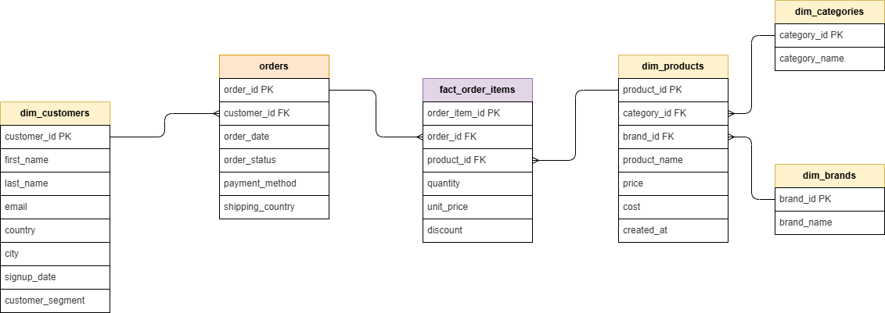
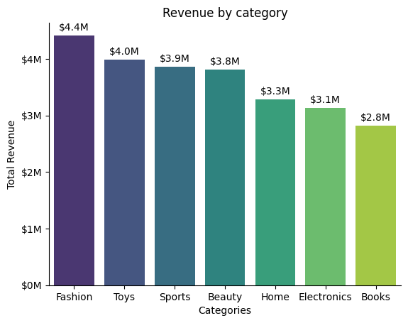
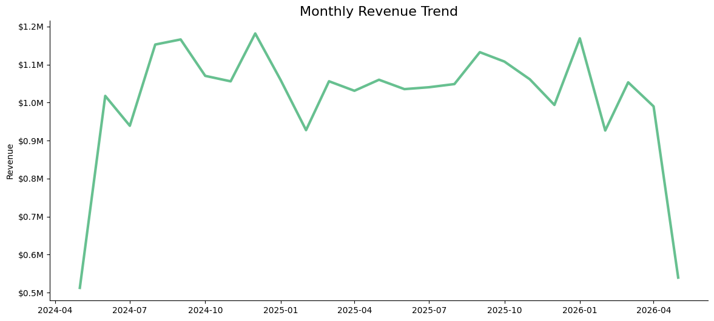
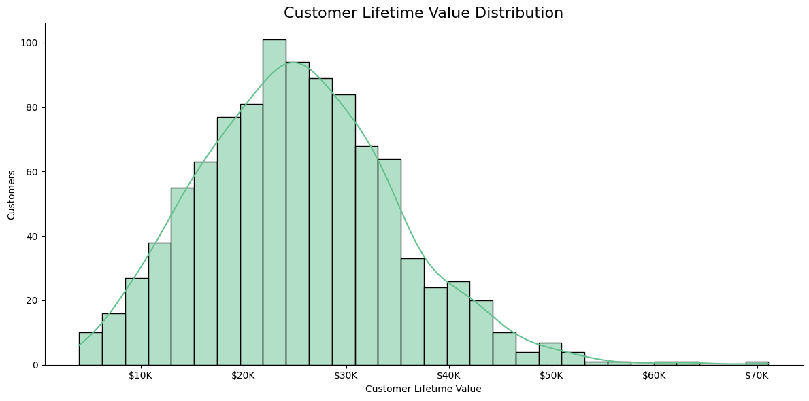

# Ecommerce Analytics with DuckDB

End-to-end ecommerce analytics project built with DuckDB, SQL, Python, and Seaborn.

---

# Project Overview

This project simulates a modern ecommerce analytics environment using a star schema data model and synthetic transactional data.

The main goal of the project is to demonstrate practical analytics engineering and SQL analytics skills through:

- Relational data modeling
- Fact and dimension table design
- DuckDB analytics workflows
- Advanced SQL queries
- Window functions
- Time-series analysis
- Customer analytics
- Data visualization with Seaborn

The project was fully developed inside Visual Studio Code using Jupyter Notebooks and GitHub version control.

---

# Business Questions

This project explores several business and analytics questions.

## Sales Analytics

- What is the total revenue generated?
- Which product categories generate the highest revenue?
- How does revenue evolve over time?
- What trends can be identified using rolling averages?

## Customer Analytics

- Which customers generate the highest lifetime value?
- What is the average order value?
- How many customers are repeat buyers?
- How concentrated is customer revenue distribution?

---

# Tech Stack

| Technology | Purpose |
|---|---|
| Python | Data generation and analytics |
| DuckDB | Analytical database engine |
| SQL | Data analysis |
| Pandas | DataFrames and transformations |
| Seaborn | Data visualization |
| Matplotlib | Plot customization |
| Faker | Synthetic data generation |
| Jupyter Notebooks | Analysis environment |
| Git & GitHub | Version control |
| draw.io | Data modeling and ERD |

---

# Data Model

The project follows a star schema design.

## Fact Table

- `fact_order_items`

## Dimension Tables

- `dim_customers`
- `dim_products`
- `dim_categories`
- `dim_brands`
- `orders`

---

# Entity Relationship Diagram (ERD)

---

# Key Analyses

## Revenue by Category

This analysis identifies which product categories generate the highest revenue contribution.

---

## Monthly Revenue Trend

Time-series analysis of revenue evolution across months.

---

## Customer Lifetime Value Distribution

Customer Lifetime Value (CLV) analysis used to evaluate revenue concentration and customer purchasing behavior.

---

# SQL Features Demonstrated

The project includes several advanced SQL concepts:

- JOINs
- Aggregations
- Common Table Expressions (CTEs)
- Window Functions
- Rolling Averages
- Time-Series Analysis
- Customer Segmentation
- Revenue KPIs

---

# Key Learnings

This project helped reinforce:

- Data modeling fundamentals
- Analytics engineering workflows
- SQL analytics best practices
- DuckDB integration with Python
- Visualization and storytelling
- Git and GitHub workflows
- Notebook organization and reproducibility

---

# Author

Built as part of a personal data analytics and analytics engineering portfolio project.